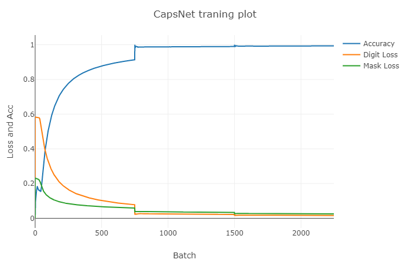
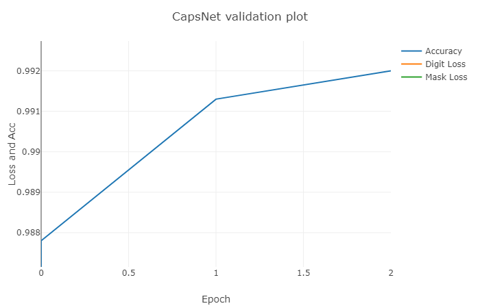
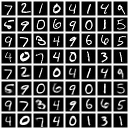

Capsule Net implementation in Gluon
===================================

This is a Gluon implementation of [Capsule Net](https://arxiv.org/abs/1710.09829).

### Dependency
- mxnet-cu80==0.12.0
- easydict==1.6
- visdom==0.1.6.3

you can fastly install them by command
```
pip install -r requirements.txt
```
### Usage

```
python train.py
```
### Evaluation
The validation accuracy is about at 99.53% (mybe need more data augmentation).  
The first three training epochs and validation graph (by [visdom](https://github.com/facebookresearch/visdom))





### Reference
[XifengGuo/CapsNet-Keras](https://github.com/XifengGuo/CapsNet-Keras)  
[Soonhwan-Kwon/capsnet.mxnet](https://github.com/Soonhwan-Kwon/capsnet.mxnet)  